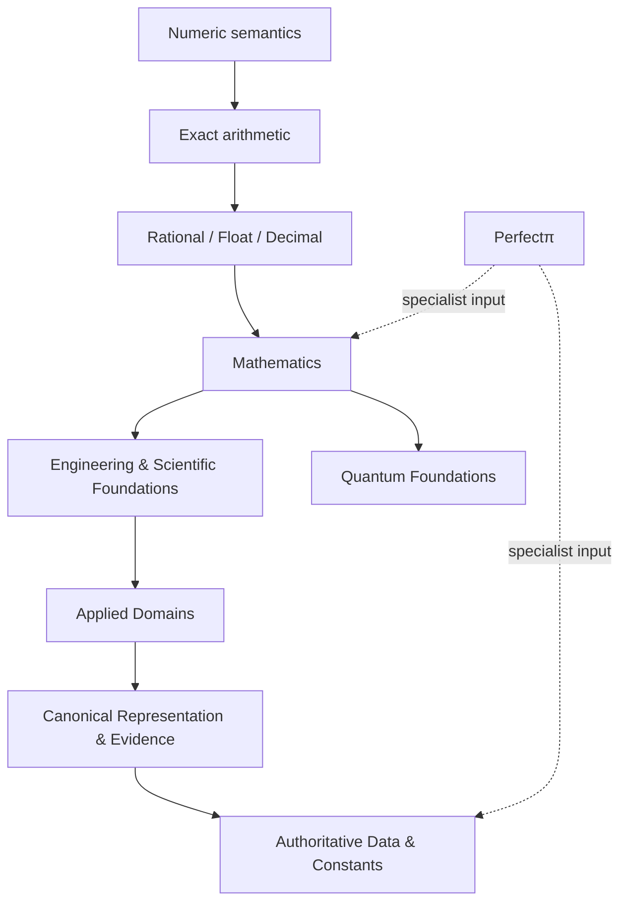

# Perfect Foundations

### High-assurance foundational Rust infrastructure for exact, deterministic, reproducible, and verifiable computing.

**Build the foundations once. Make everything above them stronger.**

---

## What Perfect Foundations is

Perfect Foundations is a coordinated family of **41 focused foundational projects** designed to sit underneath scientific, engineering, financial, navigation, biomedical, quantum, evidence-aware, and correctness-sensitive software.

The goal is not to create one giant framework. The goal is to create **small, rigorous, independently useful foundations** that can be composed without forcing applications to inherit unrelated code.

Every project is expected to answer four questions clearly:

| Question | Expected answer |
|---|---|
| **What does this crate own?** | One sharply bounded foundational domain. |
| **What does it guarantee?** | Explicit semantics for correctness, precision, determinism, resources, and failure. |
| **What does it depend on?** | Only foundations that are materially required. |
| **How is it verified?** | Independent evidence appropriate to the domain: reference vectors, fuzzing, mutation testing, standards, differential testing, or qualification. |

---

## Why this family exists

Modern Rust already has excellent libraries. Perfect Foundations is **not** an attempt to rewrite everything.

It exists for the places where one or more of these problems remain:

- serious implementations still require C, C++, Fortran, Python, JVM, or vendor runtimes;
- numerical behavior is underspecified or silently lossy;
- reproducibility depends on platform, ordering, hidden state, or implementation detail;
- strong functionality exists, but only as disconnected pieces with incompatible contracts;
- multiple projects need the same foundational primitive and should not each reinvent it;
- high-assurance applications need stronger provenance, canonical representation, uncertainty, or verification semantics.

The family therefore aims for **fewer hidden assumptions and stronger explicit contracts**.

---

## The family at a glance

| Layer | Projects |
|---|---|
| 🔢 **Numeric kernel** | Perfect Numeric · Arithmetic · Rational · Float · Decimal |
| ∑ **Mathematics** | Algebra · Number Theory · Math · Complex · Interval · Polynomial · Special Functions · Calculus · Differential Equations · Geometry |
| 🎲 **Probability & information** | Probability · Statistics · Information Theory · Error Correction |
| ⚙️ **Engineering** | Optimization · Signal · Units · Uncertainty · Mechanics · Estimation · Control |
| ⚛️ **Quantum** | Quantum Information · Circuits · Simulation · Compilation · Error Correction |
| 🌐 **Applied foundations** | Finance · Meteorology · Navigation · GNSS · Biosignal |
| 🔐 **Representation & evidence** | Wire · Evidence · CODATA · Constants |
| π **Existing specialist** | Perfectπ |

The authoritative catalog, dependency map, build order, design rules, and decisions are maintained in **[perfect-family](https://github.com/Perfect-Foundations/perfect-family)**.

---

## What “Perfect” means here

“Perfect” is the **family identity and engineering direction**, not a promise that every possible computation is mathematically exact.

Each crate must state its real guarantee precisely:

- **exact** where exactness is possible;
- **correctly rounded** where a finite representation requires rounding;
- **rigorously enclosed** where interval/ball methods are appropriate;
- **deterministic and reproducible** where the domain permits it;
- **canonical** where exact bytes matter;
- **provenanced and verifiable** where evidence matters;
- **explicitly approximate** where approximation is unavoidable.

The brand never replaces the technical contract.

---

## Engineering principles

Perfect-family projects target these principles where appropriate:

- **Pure Rust by default.** Foreign runtimes should be optional, isolated, and justified.
- **Correctness before optimization.** Performance work must preserve the contract.
- **Explicit numerical semantics.** Rounding, loss, overflow, underflow, tolerance, and uncertainty should never be mysterious.
- **Deterministic behavior where meaningful.**
- **Panic-free production paths as a design objective.**
- **`no_std` where practical.**
- **Minimal dependencies and no artificial coupling.**
- **Caller-owned or bounded resources where low-level use requires it.**
- **No hidden global state when an explicit state/configuration model is possible.**
- **Independent verification appropriate to the domain.**
- **Reuse mature Rust-native work instead of rewriting for ownership.**

---

## Architecture philosophy

This diagram shows **development lineage**, not a mandatory linear dependency chain.

The actual architecture is a DAG: every project should depend only on what it genuinely needs.

---

## Current state

### ✅ Established

- GitHub organization created and connected.
- **40 new crate names reserved** privately.
- **Perfectπ** recognized as the existing first family member.
- Organization-wide contribution, issue, security, and support templates established.
- Master architecture, build order, decisions, reuse policy, FFI policy, dependency map, lifecycle, and scope boundaries recorded.
- Cross-family qualification repository and qualification plan established.
- Master GitHub Project created for roadmap/status management.
- Every planned crate repository now has its own initial project charter.

### 🧭 Next

The first implementation track begins with the **numeric kernel**:

1. Perfect Numeric
2. Perfect Arithmetic
3. Perfect Rational
4. Perfect Float
5. Perfect Decimal

The architecture may refine as implementation exposes real constraints, but changes should be recorded deliberately rather than allowed to drift.

---

## Perfectπ

**Perfectπ / `perfect-pi`** is the first existing member of the family.

It remains at **[DrTomLLC/perfect-pi](https://github.com/DrTomLLC/perfect-pi)** while it is being completed and placed into service.

It will **not** be transferred early. Transfer into Perfect Foundations occurs only after completion, in-service status, and a dedicated transfer-readiness check.

---

## Explore

- 🗺️ **[Perfect Family](https://github.com/Perfect-Foundations/perfect-family)** — architecture, catalog, roadmap, dependency map, policies, and decisions.
- ✅ **[Perfect Qualification](https://github.com/Perfect-Foundations/perfect-qualification)** — cross-family compatibility, reproducibility, target, and integration assurance.
- 📋 **[Perfect Family Project](https://github.com/orgs/Perfect-Foundations/projects/1)** — centralized roadmap and lifecycle/status tracking.

---

### One family. Narrow contracts. Strong foundations.

